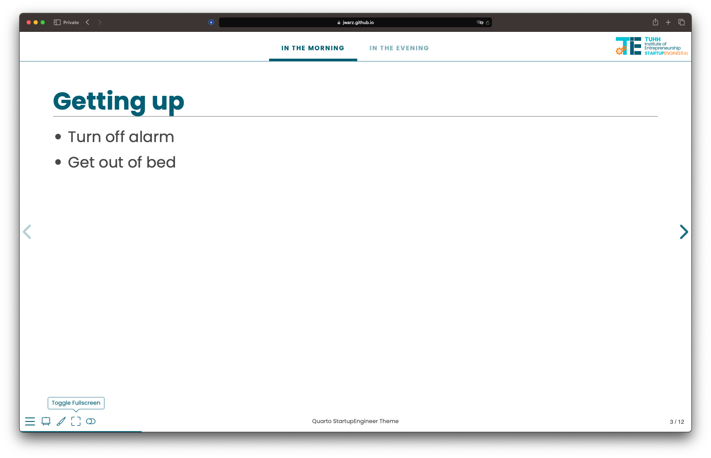

# Quarto reveal.js template - Startupengineer

This is a repository for `Quarto` `reveal.js` template. Click [here](https://jwarz.github.io/quarto-startupengineer-theme/) for a preview.

## Dark Mode


## Dark Mode



## Features

* Toggle Light & Dark Mode
* Toggle Fullscreen Button
* Progress Menu Bar

## Installation

This [Quarto](quarto.org) template can be installed/used using the following command:

```bash
quarto use template jwarz/quarto-startupengineer-theme
```

## Documentation

[`Quarto` documentation on `reveal.js` format.](https://quarto.org/docs/presentations/revealjs/)

